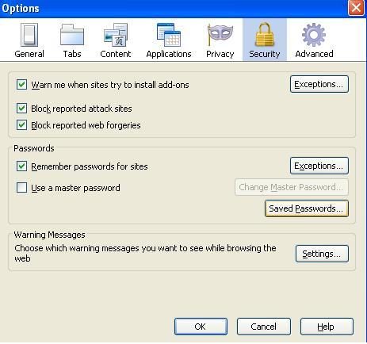

Here is simple hacking tutorial to view the saved passwords in Mozilla firefox.
While visiting public internet cafe ,some innocent peoples click the "Remember" while mozilla asking for remembering.   This is one of the benefit for us to hack their account in very simple way.

Follow these steps to see the saved Passwords:

- click the "Tools" menu in menu bar.
- Select Options
- It will open a small window
- Select the "security" tab in that small window
- You can view "saved Passwords" button
- Click that button.
- It will another small window
- There will be list of sites with usernames
- Select One site and click the "show Password"
- It will clearly show you the password